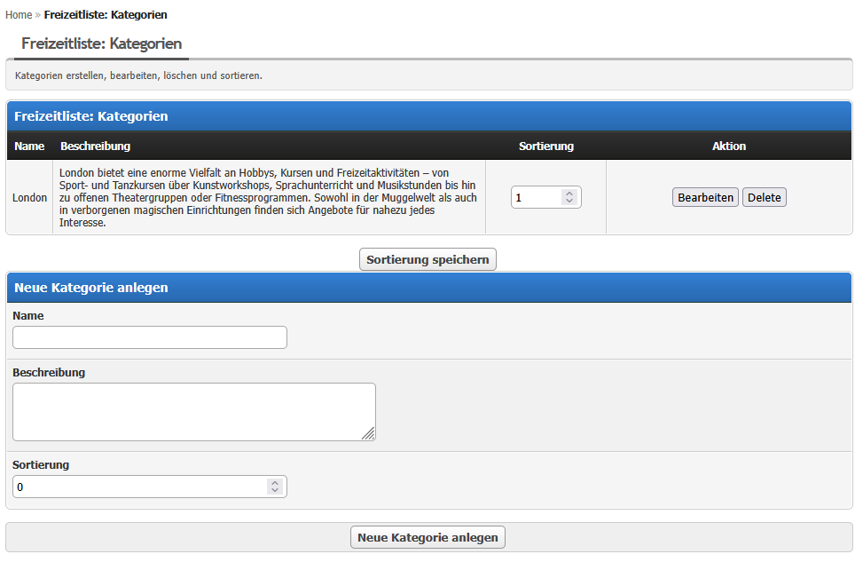
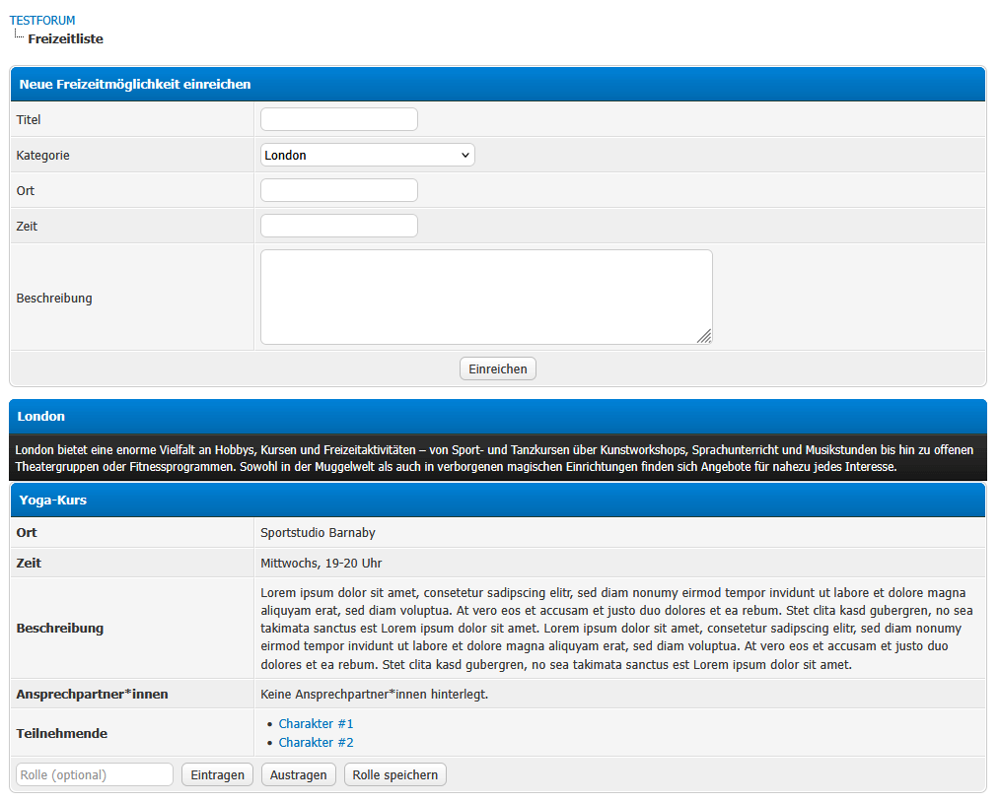
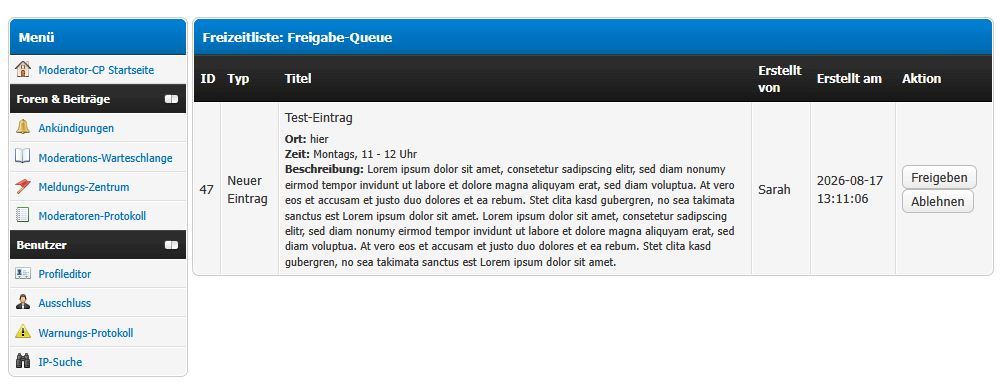

# Freizeitliste

A leisure/activity list for MyBB 1.8 RPG forums. Members of configured groups can
submit leisure activities (with location, time, description and contacts). Every
submission goes through a team approval queue in the ModCP before it becomes public.
Approved activities are shown grouped by category on a dedicated front-end page, where
members can add themselves as participants and set an optional role.

## Requirements

- MyBB **1.8.x**
- PHP **7.4** or **8.x**
- No dependencies on other plugins

## Installation

1. Upload the contents of the archive into your MyBB root directory, preserving the
   folder structure:
   - `freizeit.php`
   - `inc/plugins/freizeitliste.php`
   - `inc/plugins/freizeitliste/core.php`
   - `inc/languages/english/freizeitliste.lang.php`
   - `inc/languages/english/admin/freizeitliste.lang.php`
   - `inc/languages/deutsch_du/freizeitliste.lang.php`
   - `inc/languages/deutsch_du/admin/freizeitliste.lang.php`
2. In the Admin CP go to **Configuration → Plugins** and click **Activate** next to
   *Freizeitliste*.
3. Configure the plugin under **Configuration → Settings → Freizeitliste** (see
   [Configuration](#configuration)).
4. Create at least one category under **Configuration → Freizeitliste** (see
   [Usage](#usage)).

## Configuration

Under **Admin CP → Configuration → Settings → Freizeitliste**:

- **Groups allowed to submit** (`freizeitliste_submit_groups`) – user groups whose
  members may submit new leisure activities on the front-end page. Default: `4`
  (Administrators).
- **Groups with ModCP approval rights** (`freizeitliste_modcp_groups`) – user groups
  whose members may approve/reject submissions and manage contacts in the ModCP.
  Default: `4`.
- **Groups allowed to view participants** (`freizeitliste_view_participants_groups`) –
  user groups whose members may see the participant list of an activity. Default:
  `2,3,4,6`.

Group settings accept a comma-separated list of group IDs. `-1` means "all groups".

## Usage

### First steps after activation

1. Set the three group settings (see [Configuration](#configuration)).
2. Create your categories: **Admin CP → Configuration → Freizeitliste**. Enter a
   name, an optional description and a display order, then click **Add new category**.
   Categories can later be edited, deleted and re-sorted on the same page.

### Submitting an activity (members)

A member of a *submit* group opens `freizeit.php` (e.g. link it in your menu) and fills
in the submission form at the top of the page: title, category, location, time and an
optional description. After submitting, the entry is stored as **pending** and added to
the team approval queue – it is **not** visible to others until approved.

### Approving submissions (team)

Team members (a *ModCP* group) see a red alert on the forum index when items are
waiting. The alert links to **ModCP → Leisure list: Approval queue**. There, each
pending item can be **approved** or **rejected**:

- Approving a *new entry* publishes the activity.
- Rejecting a *new entry* deletes it together with its participants and contacts.
- Contact changes (see below) are queued as their own approval items.

### Managing contacts (team)

Under **ModCP → Leisure list: Manage contacts**, team members can queue adding or
removing a contact (by username) for any approved activity. The change only takes
effect once it is approved in the queue.

### Participating (members)

On the front-end page every logged-in member can **join** or **leave** an approved
activity and set an optional **role**. Whether the participant list is visible depends
on the *view participants* group setting.

## Uninstallation

1. **Admin CP → Configuration → Plugins → Deactivate** next to *Freizeitliste*.
2. Click **Uninstall** to remove all plugin data. This drops the plugin tables
   (`freizeit_categories`, `freizeit_entries`, `freizeit_contacts`,
   `freizeit_participants`, `freizeit_pending_changes`), settings, setting group and
   templates.
3. Optionally delete the uploaded files listed under [Installation](#installation).

## Changelog

See [CHANGELOG.md](CHANGELOG.md).
